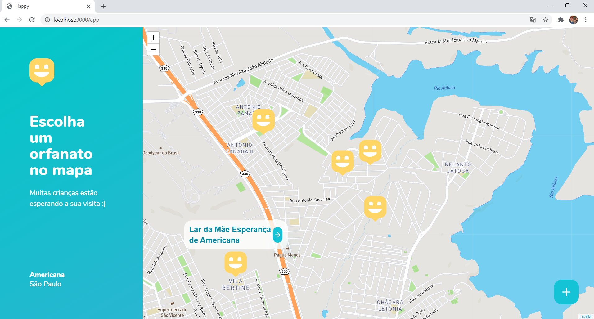

# rocketseat-nlw-03
Projeto contruído durante o Next Level Week #03.

# Descritivo
Trata de uma solução (Happy), que é uma ferramenta multiplataforma onde são localizados Orfanatos da cidade de Americana/SP, Possibilitanto tanto o cadastro da entidade quanto a realização da busca por informações da mesma, utilizando um site na Web quanto um aplicativo Mobile.

# backend
Desenvolvido em NodeJS

**(Para testar) yarn start
(http://localhost:3333)

## screenshots

# web
Desenvolvido em ReactJS

**(Para testar) yarn start
(http://localhost:3000)

## screenshots

# mobile
Desenvolvido em React Native

**(Para testar: Expo) yarn start

## screenshots

### Tecnologias e Bibliotecas utilizadas
• TypeScript

• TypeORM

• SQLite

• CORS

• Express

• React-Icons (Feather Icons)

• React-Router-DOM

• Axios

• Leaflet 

• React-Leaflet

• Multer

• Express-Async-Errors

• Yup

• Expo

• Expo-Google-Fonts

• React-Navigation (Stack/Tabs)

• React-Native-Gesture-Handler

• React-Native-Reanimated

• React-Native-Screens

• React-Native-Safe-Area-Context

• React-Native-Picker-Select

• Expo-Image-Picker

